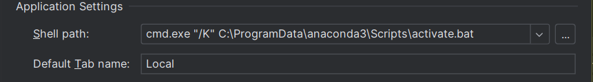

# comprehensive-mlops
## A. commands used
### 1. creating env 
#### 1.1 Pycharm
1. Go to ``File -> Settings -> Tools -> Terminal -> Application Settings``
2. Replace the value in Shell path with ``cmd.exe "/K" C:\path\to\Anaconda3\Scripts\activate.bat``

```commandline
conda create -p venv python==3.11

conda activate venv/
```